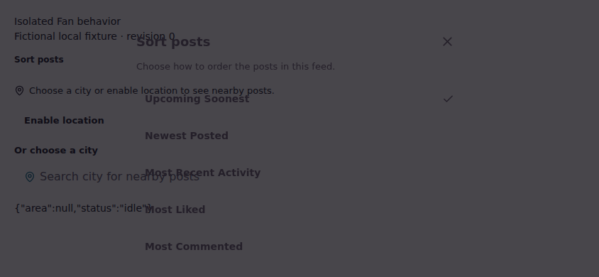
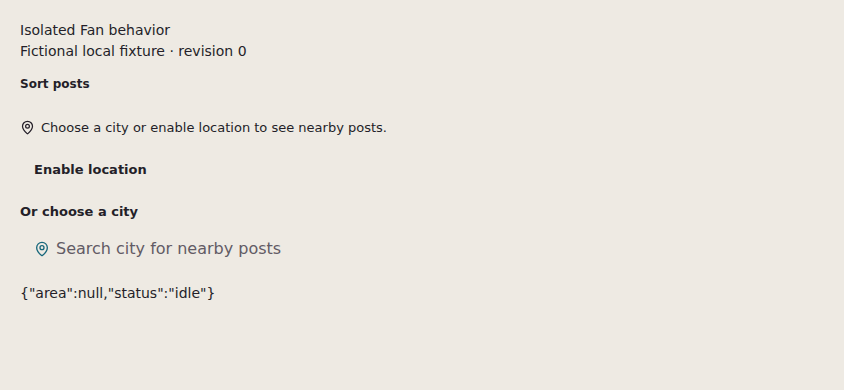

# October 9 Fan sort startup repair

A real startup race was reproduced in the actual `FanSortSheet`: a trusted backdrop click can arrive after the sheet is visible but before Radix installs its document `pointerdown` listener. The sheet then stays open and the exact trigger does not regain focus. The narrow overlay-click fallback repairs this demonstrated window. **The cause of the historical R09 CI failure remains unproven.** Its artifact did not capture listener timing, dialog presence after the click, or the focus trace needed to establish that attribution.

The starting source was PR #18 head `27d1c58f17a3d3bf0b677023967b4306e0ae42bf`. No existing Fan assertion, raw `(2, 2)` action, timeout, or production data was changed to obtain a pass.

## Observed failure and repair

The exact existing full Fan Zone runner first passed all 19 scenarios unchanged. A separate bounded diagnostic then mounted the actual component in the existing isolated Fan behavior fixture and recorded native registration, pointer and focus events. On light-theme 844 × 390, cycle 1:

| Event | Browser time | State |
|---|---:|---|
| Focus enters Close button | 324.80 ms | Dialog visible; no document outside-pointer listener |
| Trusted pointerdown on backdrop at `(2, 2)` | 330.10 ms | Listener count 0 |
| Radix registers `handlePointerDown` | 332.70 ms | Registration occurs 2.60 ms after the click's pointerdown |
| Original 30-second wait expires | — | Dialog still visible; focus on body; original trigger still connected |

Seven earlier raw-backdrop cycles in that diagnostic had passed. This was observed without holding callbacks, replacing their implementation, changing native timers, adding sleeps, or retrying a failure. See the [before trace](oct09-evidence/fan/startup-before-listener-trace.json).

The locked packages were `@radix-ui/react-dialog` 1.1.15, `@radix-ui/react-dismissable-layer` 1.1.11 and `@radix-ui/react-focus-scope` 1.1.7. The installed dismissable-layer source schedules its document outside-pointer registration in `setTimeout(..., 0)`, consistent with the captured ordering.

`FanSortSheet` now handles a direct primary click on its overlay if the sheet is still mounted. It ignores control-left and other mouse buttons, consumes the click, stops propagation and invokes the existing close callback. Normal Radix dismissal remains in place. The fallback uses `click`, so a touch start or drag alone does not close the sheet. Content clicks do not target the overlay. The existing Radix close autofocus callback restores the exact original trigger.

## Bounded verification

| Check | Result | Evidence |
|---|---|---|
| Existing full Fan runner before the change | 19 passed | Local continuation `tests/artifacts/oct09-continuation/r09/exact-runner.txt`; final aggregate is recorded by the parent repair report |
| Deterministic before-source startup test | Failed as expected on first mouse case; dialog remained visible for the unchanged 30-second wait | [Before report](oct09-evidence/fan/startup-deterministic-before-report.json) |
| Fixed deterministic startup suite | 16 passed; repeated once to capture the after screenshot, again 16 passed | [After report](oct09-evidence/fan/startup-deterministic-after-report.json) |
| Fixed native-timing diagnostic | All 18 raw clicks closed and restored the original trigger, including 9 whose pointerdown arrived before listener registration | [After trace](oct09-evidence/fan/startup-after-listener-trace.json) |

The deterministic runner covers both themes at 844 × 390: mouse and touch clicks while registration is withheld; right/control click, inside click, mouse drag and touch drag exemptions; and normal installed-listener mouse/touch paths. Every successful case asserts exactly one close callback, exact original-trigger focus, no queued or active outside-pointer listeners after unmount/release, zero unexpected SDK calls, zero geolocation calls, zero forbidden network attempts and zero browser errors. It is now the fifteenth runner in `test:audit-browser`.

The deterministic experiment deliberately withholds only Radix's document `pointerdown` registration. It leaves native timers and callback implementations unchanged, then explicitly releases registration. Unmount removes queued registrations before release, so a held listener cannot leak into a later case. This controlled experiment proves the fix covers the observed window; it does not retroactively prove the historical CI failure used the same ordering.

The observed-event diagnostic wraps document registration methods to record calls and adds capture-phase event observers. It preserves the native callback objects, native timer behavior and normal registration timing, but any instrumentation can affect scheduling. Its event ordering is evidence of this reproduced run, not a measurement of how frequently users encounter the race. The [portable diagnostic](oct09-evidence/fan/startup-listener-trace.mjs) retains the same bounded six contexts and three raw-click cycles per context.

## Screenshots and limits

These screenshots show a synthetic component harness in light theme at 844 × 390, with no authenticated role. They do not establish ordinary-member or administrator workflow coverage. They demonstrate the dialog remaining open before the repair and absent after a successful startup-window click. The after screenshot is taken only after dialog closure, exact-trigger focus, once-only callback and listener-cleanup assertions. Focus is verified programmatically; pointer focus need not display a focus-visible outline. This is not a production styling review.

| Before | After |
|---|---|
|  |  |

Runtime: Node 24.19.0, Playwright 1.62.1 and isolated Chromium **153.0.8010.0**. The attempted Playwright Chromium **151.0.7922.34** download was truncated and unusable, so historical-browser parity was not achieved. No production app, live browser, Base44 service, external provider, real location, posts or mutations were exercised. All location and app data came from the fail-closed local fixture. The prior historical R09 uncertainty remains explicitly open.

## Reproduction commands

Run from the repository root. These are the runtime settings used here; an environment with Playwright's installed browser can omit the executable override.

```sh
export PG_CHROMIUM_PATH=/workspace/scratch/580f2607a348/browser-runtime/executable/chromium-oct09
export PG_CHROMIUM_ARGS='["--no-sandbox","--disable-dev-shm-usage"]'

# Preserve the old component locally without changing the worktree.
mkdir -p tests/artifacts/oct09-continuation/r09
git show 27d1c58f17a3d3bf0b677023967b4306e0ae42bf:src/components/fanzone/FanSortSheet.jsx > tests/artifacts/oct09-continuation/r09/FanSortSheet-before.jsx

# Expected failure: Vite serves only this component from the old local source.
PG_FAN_SORT_BEFORE_SOURCE=tests/artifacts/oct09-continuation/r09/FanSortSheet-before.jsx PG_FAN_SORT_EVIDENCE_DIR=tests/artifacts/oct09-continuation/r09/deterministic-before node tests/fan-sort-startup-browser.mjs

# Expected success: actual current component; no listener timing retries.
PG_FAN_SORT_EVIDENCE_DIR=tests/artifacts/oct09-continuation/r09/deterministic-after node tests/fan-sort-startup-browser.mjs

# Bounded observed-event diagnostic: no registration or timer holds.
node docs/reviews/oct09-evidence/fan/startup-listener-trace.mjs

# Existing original gate plus the new startup runner and other isolated suites.
npm run test:audit-browser
```

The standalone startup runner starts its own fail-closed Vite fixture on port 4195; the trace diagnostic uses port 4194. The aggregate manages its fixture and individual runners. Do not point these commands at a deployed app.
